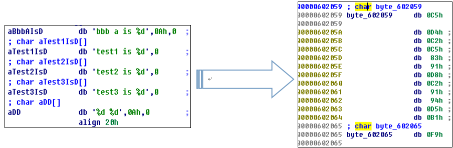
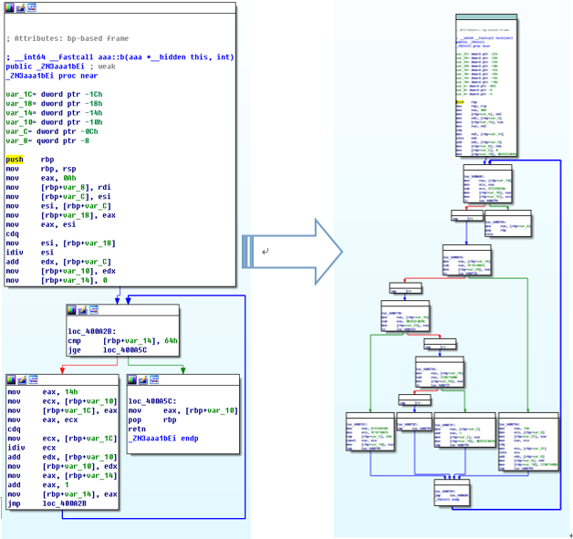
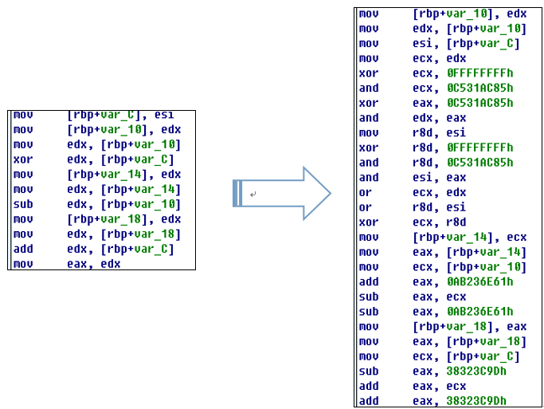

# Armariris
孤挺花（Armariris） --  由上海交通大学密码与计算机安全实验室维护的LLVM混淆框架

## 中文
孤挺花（Armariris）: 基于LLVM的支持多平台多语言的混淆器

本项目名取自细音启小说<黄昏色的咏使>以及<冰洁镜界的伊甸>中的人物孤挺花. 她即便无人理解依然守护着姐姐与世界. 

Armariris是作者自创语言Selahpheno中孤挺花的意思.

目前开放功能包括：
 - 字符串加密.
  
- 控制流扁平化
  
- 指令替换
  

### 安装

```shell
mkdir obf
cd obf
clone git@github.com:gossip-sjtu/Armariris.git
cmake -DCMAKE_BUILD_TYPE:String=Release ./Armariris
make -j4
```

### 用法
编译时候添加选项开启字符串加密
```shell
-mllvm -sobf
```
开启控制流扁平化
```shell
-mllvm -fla
```
开启指令替换
```shell
-mllvm -sub
```
指定随机数生成器种子
```shell
-mllvm -seed=0xdeadbeaf
```

## English

Armariris: an obfuscator based on LLVM project for multiple languages and platforms. 

Currently support:
 - string obfuscation
 - control flow flattening
 - instruction substitutions


### Armariris
Armariris is the alias of Amaryllis in conlang Selahpheno in sazaneK's light novel. 
Amaryllis is a character in light novel <黄昏色の詠使い> and <氷結鏡界のエデン> written by 細音啓(sazaneK). 
Although nobody unserstands her, she still guards her sister and the world persistently.


### Install
```shell
mkdir obf
cd obf
clone git@github.com:gossip-sjtu/Armariris.git
cmake -DCMAKE_BUILD_TYPE:String=Release ./Armariris
make -j4
```

### Usage
Add option  for opening string obfuscation when compiling. 
```shell
-mllvm -sobf
```
Add option  for opening control flow flattening when compiling. 
```shell
-mllvm -fla
```
Add option  for opening instruction substitutions when compiling. 
```shell
-mllvm -sub
```
Add option for setting random seed.
```shell
-mllvm -seed=0xdeadbeaf
```
